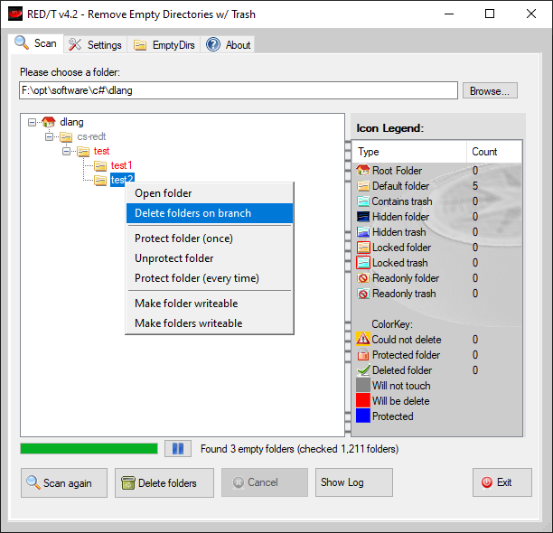
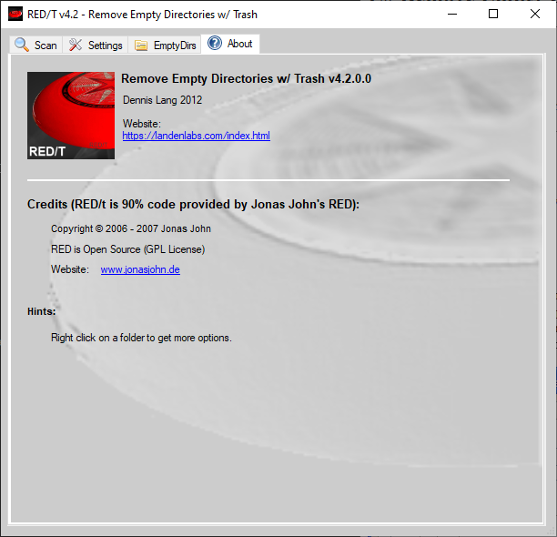

redt

### C# Remove Empty Directories with Trash (Jan-2025)

Please read [documentation on website](https://landenlabs.com/cs_red/red.html) for latest notes.

## Author / credits

Author:
  Dennis Lang 2009-2025
  https://landenlabs.com

## Description
 

C# Application to remove empty directories. 
This app was started with code was a program written by Jonas David John ( http://www.jonasjohn.de/). 
I modified the program to fix a few bugs, add stats to the legend, add additional menu picks and add the List view tab.

### Features include:
 * Define which files maybe present in empty directory
 * Mark directories to permanently ignore or temporarily ignore
 * View empty directories as Tree or List view.
 * Delete All, Branch or selected directories.

### Screens

[Top](#top)
